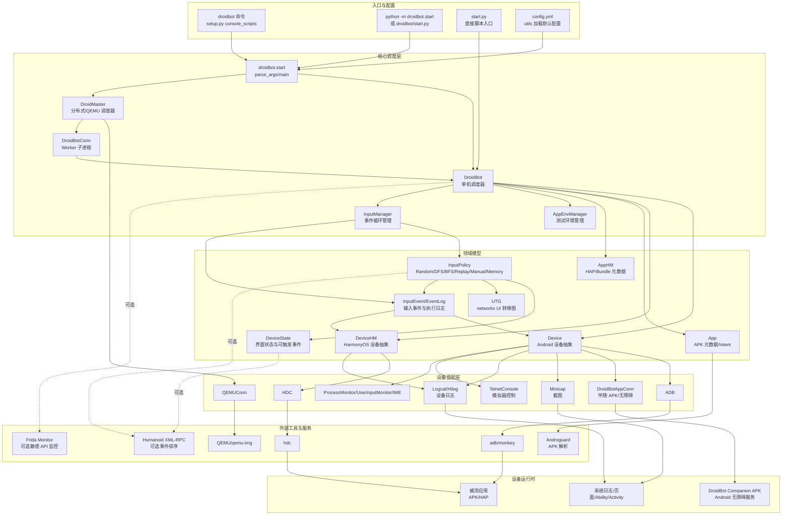
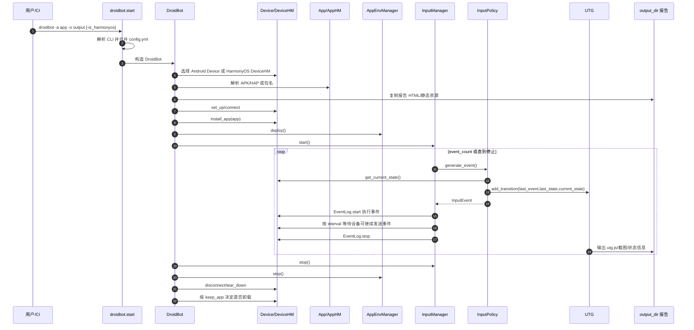
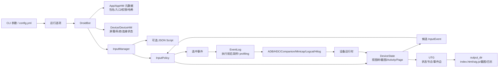
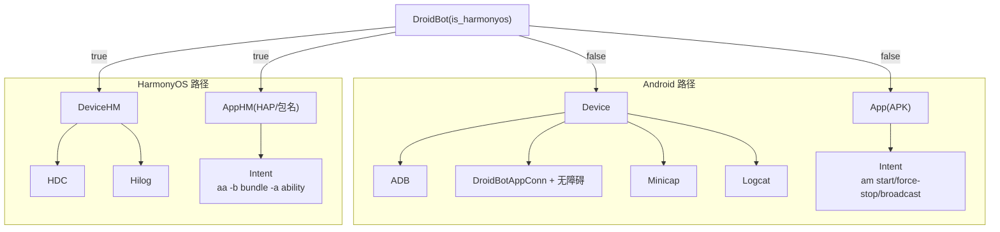
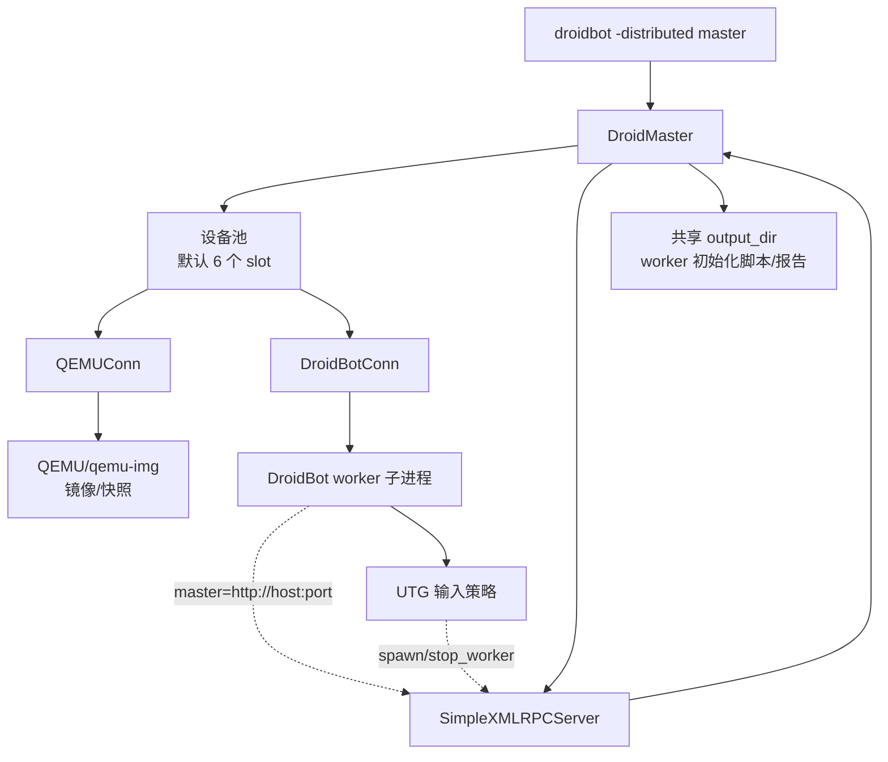

# HMDroidbot 架构图

HMDroidbot 是一个 Python 实现的 HarmonyOS / Android UI 自动探索与测试输入生成器，核心模型是“命令行配置 -> DroidBot 调度 -> 输入策略生成事件 -> 设备适配层执行 -> 输出 UTG 和报告”。

## 总览架构

## 单机运行时序

## 模块职责

| 模块 | 职责 |
| --- | --- |
| `droidbot/start.py` | 包装 CLI 参数、YAML 配置和启动模式，选择单机 `DroidBot` 或分布式 `DroidMaster`。 |
| `droidbot/droidbot.py` | 主协调器，负责输出目录、设备/应用模型、环境管理器和输入管理器的生命周期。 |
| `droidbot/droidmaster.py` | 分布式模式控制器，维护 QEMU 设备池，通过 `DroidBotConn` 启停 worker，并通过 XML-RPC 与 worker 协作。 |
| `droidbot/adapter/droidbot.py` | `DroidBotConn`：由 `DroidMaster` 调用的 worker 生命周期封装（`subprocess` 启动 `droidbot -distributed worker`）。架构上归入核心调度层，与 `DroidMaster` 同级。 |
| `droidbot/device.py` | Android 设备抽象，聚合 ADB、Minicap、Logcat、伴随 APK、IME、进程/输入监控等适配器。 |
| `droidbot/device_hm.py` | HarmonyOS 设备抽象，主要通过 HDC/Hilog 与设备通信。 |
| `droidbot/app.py` | 使用 Androguard 解析 APK 包名、Activity、权限、广播和文件哈希。 |
| `droidbot/app_hm.py` | 解析 HAP 包或通过 `bm dump` 读取已安装 HarmonyOS 包信息。 |
| `droidbot/input_manager.py` | 创建输入策略，维护事件列表、脚本输入、事件间隔和 Monkey/手动模式。 |
| `droidbot/input_policy.py` | 定义随机、DFS/BFS、回放、手动等输入策略，并把界面状态转化为下一步事件。 |
| `droidbot/input_policy2.py` | 扩展的 memory-guided 输入策略。 |
| `droidbot/utg.py` | 基于 `networkx.DiGraph` 维护 UI 转移图，并输出测试报告中的 UTG 数据。 |
| `droidbot/device_state.py` | 表示当前界面树、截图、页面/Activity 信息和可执行输入事件。 |
| `droidbot/input_event.py` | 定义触摸、按键、Intent、文本、杀进程等事件及事件执行日志。 |
| `droidbot/adapter/` | 封装 ADB、HDC、日志、截图、QEMU、DroidBot 伴随 APK 和 HarmonyOS driver 等设备/虚拟机侧协议（不含 `DroidBotConn`，见上）。 |
| `droidbot/resources/` | 报告页面、样式、前端脚本、伴随 APK 和 JS hook 资源。 |

## 关键数据流

## 平台差异

## 分布式模式

## 备注

- 总览图中 `DroidBotConn` 画在核心调度层：它由 `DroidMaster` 直接持有，负责 worker 子进程启停，属于分布式调度基础设施；`QEMUConn` 仍放在设备适配层，对应虚拟机资源接入。二者源码均在 `droidbot/adapter/` 目录，分层按职责而非目录。
- 默认输入策略是 `dfs_greedy`，入口参数也支持 `none`、`monkey`、`random`、`dfs_naive`、`bfs_naive`、`bfs_greedy`、`replay`、`manual` 和 `memory_guided`。
- `input_manager.py` 引用了 `llm_guided` 对应的 `input_policy3.py`，但当前仓库未包含该文件，因此该策略在当前源码树中不可用。
- 项目没有内置数据库，主要持久化目标是 `output_dir` 中的报告资源、UTG、截图、日志和状态文件。
